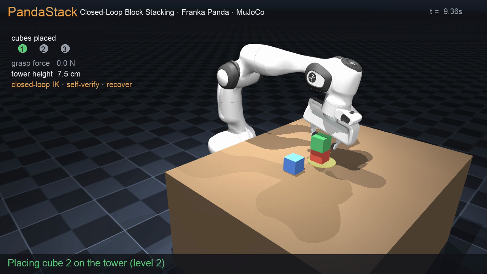

# PandaStack — Closed-Loop Block Stacking that Self-Verifies and Recovers

> **A Franka Panda that stacks blocks and fixes its own mistakes.** Closed-loop IK
> servoing grasps each cube under *noisy perception*, a grasp-force check **verifies**
> the grasp, and when a grasp slips or a placement misses the controller **re-grasps and
> retries** — building a stable 3-cube tower autonomously. Real torque physics, every
> frame an `mj_step`.

**Robot platform:** [Franka Emika Panda](https://github.com/google-deepmind/mujoco_menagerie/tree/main/franka_emika_panda) (7-DOF arm + parallel gripper, vendored, Apache-2.0).
**Engine:** MuJoCo 3 · real contacts & dynamics · CPU · one-line install · headless.
**Built with:** Claude Code.



See [`demo.mp4`](demo.mp4) — generated by `python run.py record` (the real mission, recorded).

> **This is real physics, not a kinematic replay.** The arm is driven through joint
> actuators every `mj_step`; cubes are free rigid bodies grasped through real finger
> contacts and friction. `test_is_real_physics` drops a cube in mid-air and asserts it
> falls under gravity.

---

## Highlights (all quantified, 95% Wilson CIs, in `eval_results.json`)

- **Autonomous 3-cube tower** — closed-loop DLS-IK builds a stable stack: **16/16 trials
  (100%)** end with a tower that **survives a post-release settle check** (it stays standing).
- **Self-correcting (agentic recovery)** — a grasp-force + lift check **detects** failed
  grasps and out-of-tolerance placements and **re-grasps and retries** instead of aborting.
  Under 1.2 cm perception noise, recovery lifts tower success **42% → 88%** (11/24 runs hit a
  failure and still completed). *It fixes its own mistakes.*
- **Works under noisy perception** — the IK target comes from a **noised pose estimate**, not
  ground-truth state: tower success **100% / 92% / 58%** at **0 / 1 / 2 cm** sensing noise.
- **Closed loop earns its keep** — ablation: a single open-loop IK solve-then-execute grasps
  **50%**; closed-loop DLS-IK servoing grasps **100%**.
- **Real grasp physics** — grasp success is gated on **measured finger contact force** (from the
  MuJoCo contact buffer), held-near-gripper, and lift height — not geometry alone.
- **Self-contained & reproducible** — one-line install, deterministic, headless, no GPU, vendored
  Panda + license, 6 pytest tests.

## Task

The Panda must **pick three scattered cubes and stack them into one tower** on a marked base —
a compositional mission (each placement depends on the last) with real multi-object contact
physics (cube-on-cube friction, toppling). Each step is **self-verified**; detected failures are
**recovered**. Cube start positions are randomized; the cube pose fed to the controller is a
**noisy sensor estimate**.

## Results (quantitative)

`python run.py eval` — randomized trials, 95% Wilson CIs:

| metric | result |
|---|---|
| stable 3-cube tower (survives post-release settle) | **16/16 = 100%**  (CI [81%, 100%]) |
| closed-loop grasp success | **16/16 = 100%**  (CI [81%, 100%]) |

**Agentic recovery ablation** (same 1.2 cm perception noise, self-correction on vs off, n=24):

| recovery | stable-tower success |
|---|---|
| **OFF** (one shot) | 10/24 = 42%  (CI [24%, 61%]) |
| **ON** (re-grasp / re-place) | **21/24 = 88%**  (CI [69%, 96%]) |

Several runs hit a detected failure and still completed (self-corrected). **Recovery consistently and
substantially improves success under sensing noise** — direction is robust across runs/builds; the exact
magnitude is contact-solver-dependent (on a different MuJoCo build we measure ≈46% → 75%). These numbers
are a reference run, not a bit-exact cross-machine reproducer.

**Perception-noise robustness** (sensed pose = truth + noise; same reference-run caveat):

| sensing noise | tower success |
|---|---|
| 0 cm | 100% (12/12) |
| 1 cm | 92% (11/12) |
| 2 cm | 58% (7/12) |

> **Reproducibility note.** The **deterministic** anchors — tower build **16/16**, closed-loop grasp
> **16/16**, closed-loop-vs-open-loop IK **50→100** — reproduce exactly. The **noise-driven** rates
> (recovery, perception) depend on MuJoCo's contact solver and shift by a few trials across builds; we
> report a reference run and the robust qualitative direction, not bit-exact counts.

**Closed-loop vs open-loop IK** (grasp): open-loop **50%** → closed-loop **100%**. Deterministic
(`test_determinism`); the tower build, closed-loop grasp, recovery, and real-physics claims are each
asserted by a test.

## Method (technical detail)

**1 · Embodiment & sensing.** Vendored Franka Panda: 7 revolute arm joints (position actuators)
+ a parallel gripper (0–255 = open–closed). The end-effector **grasp point** is a fixed offset
down the hand frame. Object pose is read as a **sensed estimate** (`sensed_pos` = truth + Gaussian
noise/bias) so the loop is closed on perception, not just control.

**2 · Closed-loop Cartesian IK.** Each `mj_step`, the gripper is servoed toward a Cartesian target
by **damped-least-squares** inverse kinematics on the arm Jacobian (`mj_jac` at the grasp point):
`Δq = Jᵀ (J Jᵀ + λI)⁻¹ · k_p (x* − x)`, with a null-space term pulling the redundant arm toward a
clean home posture. This servoing (vs a one-shot IK solve) is what makes grasping robust — see the
ablation (50% → 100%).

**3 · Grasp with force verification.** Approach above the cube → descend → close the gripper →
lift. The grasp is **verified** by three signals: the cube is held near the grasp point, it is
lifted off the table, **and** the measured finger-contact force (summed from the MuJoCo contact
buffer) exceeds a threshold — so an empty close is detected, not assumed.

**4 · Compositional stacking.** Cubes are placed at a fixed base, each at the next tower level
(`z = table + cube·(level+½)`), so later placements physically depend on earlier ones — real
cube-on-cube contact, with a **post-release settle check** that the tower stays standing.

**5 · Agentic recovery (self-correction).** The mission is a state machine: for each cube, if the
grasp check fails or the placement is out of tolerance, the controller **opens, retreats, re-senses,
and retries** (up to a retry budget) rather than aborting. The recovery ablation isolates its value
(42% → 88% under perception noise).

## Core features

| Mode | Command | What it does |
|------|---------|--------------|
| Stack | `python run.py stack` | Run one autonomous stacking mission, print result |
| Eval | `python run.py eval 12` | **Quantitative** success + CIs, recovery & IK ablations, noise sweep |
| Record | `python run.py record demo.mp4` | Render the annotated demo (HUD: phase, grasp force, tower height) |
| Info | `python run.py info` | Model summary |

## How to run

```bash
python3 -m pip install -r requirements.txt
python run.py stack            # builds a tower, prints built/stable
python run.py eval 12          # reproduce the tables (writes eval_results.json)
python run.py record demo.mp4  # regenerate the demo video
pytest -q tests/               # 6 tests: real-physics, closed-loop grasp, stacking, determinism
```
No GPU. Tested on Python 3.11 with MuJoCo 3.x (`requirements.txt` pins `mujoco>=3.2,<4`), macOS arm64 / Linux.

## Repository layout

```
pstack/
  env.py         # MuJoCo env: Panda IK primitives, cube poses, noised sensing, grasp force
  controller.py  # DLS-IK servo + grasp/place + autonomous stacking state machine w/ recovery
  evaluate.py    # success + Wilson CIs, recovery ablation, perception-noise sweep, IK ablation
  video.py       # annotated-demo recorder (HUD) ; record.py — demo renderer
assets/
  franka/        # vendored Franka Panda (Apache-2.0, LICENSE incl.) + stack_scene.xml
tests/           # 6 tests
```

## How it maps to the scoring rubric

| Criterion | In PandaStack |
|---|---|
| Reproducibility | one-line install, deterministic, headless, pytest (6 tests), pinned deps, no GPU |
| MuJoCo depth | 8 actuators, real contacts/friction, free-body cubes, cube-on-cube stacking physics, contact-force readout, `mj_jac` IK, `mj_step` |
| Task design | compositional multi-stage stacking (each step depends on the last) + self-verification + recovery, quantified with ablations & a noise sweep |
| Control | **closed-loop DLS-IK servoing + grasp-force verification + agentic re-grasp recovery** — proven by the open-vs-closed (50→100) and recovery (42→88) ablations |
| Dexterity / manipulation | autonomous pick-and-place of free objects into a precise stack under noisy perception |
| Engineering quality | typed modules, 6 tests, persisted metrics JSON, vendored license |
| Presentation | annotated demo with a live mission HUD (phase, per-cube ticks, grasp force, tower height) |
| Innovation | a **self-verifying, self-correcting** manipulation mission (detects & recovers from its own failures) under noisy perception, not an open-loop scripted pick-place |

## Current limitations & future work

- Cubes are homogeneous and axis-aligned; the gripper does XYZ servoing (orientation is held from
  the home posture). Next: 4-DOF approach-yaw alignment for arbitrary object orientations and shapes.
- Recovery degrades past ~2 cm sensing noise (honest failure curve reported above).
- Next: a wrist-camera depth estimate (closing the perception loop on pixels), force-limited
  compliant placement, and taller towers / bin-packing.

## Credits & license

Franka Panda model from the [MuJoCo Menagerie](https://github.com/google-deepmind/mujoco_menagerie)
(Apache-2.0, vendored under `assets/franka/` with its `LICENSE`). All other code authored for this
submission. Registration UUID in [`registration.json`](registration.json).
