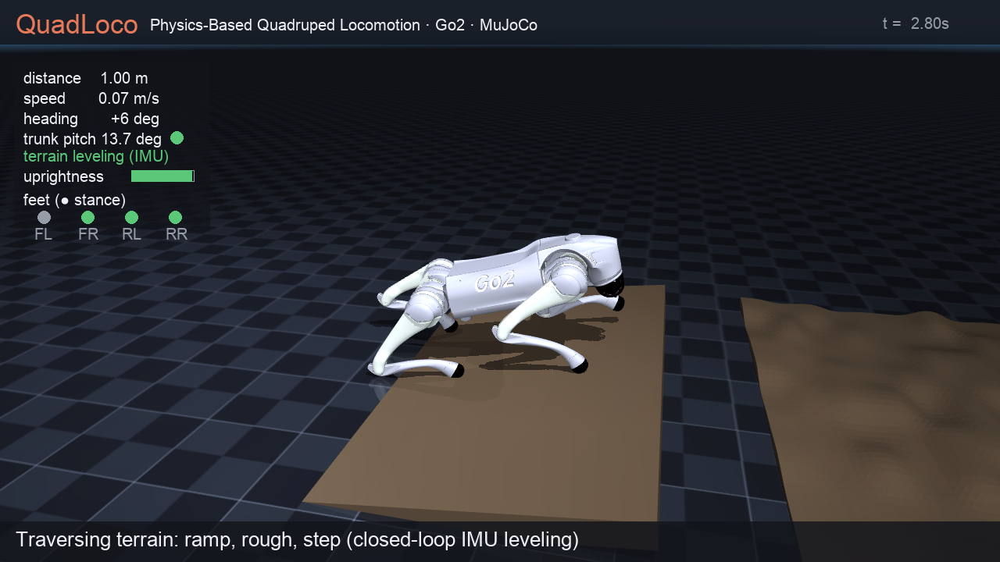
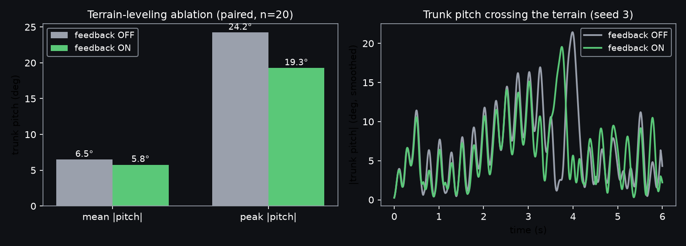
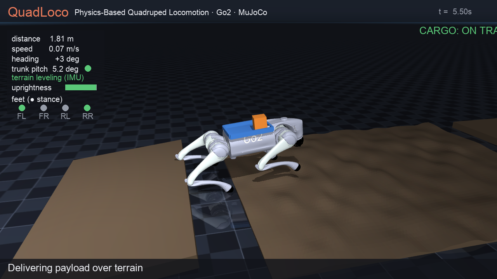

# QuadLoco — Closed-Loop Terrain-Adaptive Quadruped Locomotion

> **A Go2 that feels the ground.** Three proprioceptive feedback loops keep the trunk
> level over a ramp + rough patch + step, hold heading to a 0.15 m line, take a 130 N
> shove mid-stride and recover, and even **deliver a free payload across the terrain
> without dropping it** — **real torque physics, every frame an `mj_step`.**

**Robot platform:** [Unitree Go2](https://github.com/google-deepmind/mujoco_menagerie/tree/main/unitree_go2) (12 torque-controlled joints, BSD-3).
**Engine:** MuJoCo 3 · real dynamics & contacts · CPU · one-line install · headless.
**Built with:** Claude Code.



See [`demo.mp4`](demo.mp4) (locomotion patrol) and [`demo_cargo.mp4`](demo_cargo.mp4)
(loco-manipulation delivery) — generated by `python run.py record` / `record-cargo`.

> **This is real physics, not animation.** Every frame advances `mj_step` with
> closed-loop **torque** control through ground contacts. (For contrast, the
> starter's quadruped example is a *kinematic puppet* — it writes `qpos` directly
> with `mj_forward`, no dynamics. A dedicated test, `test_is_real_physics`, proves
> ours responds to gravity.)

---

## Highlights

- **Three closed-loop feedback loops, integrated** — one controller fuses (1) a CPG trot,
  (2) **IMU + gyro heading-hold**, and (3) **contact-gated IMU terrain-leveling**, all on
  proprioception (orientation, yaw-rate, foot contacts) over the full rigid-body dynamics.
  *True closed-loop integration, not open-loop scripting.*
- **Closed-loop terrain feedback** — active body-leveling keeps the trunk level over ramp +
  rough heightfield + step. **Paired ablation (n=20):** the loop cuts **peak** trunk pitch
  **24.2° → 19.3°** (mean 6.5° → 5.8°, paired Δ 0.71 ± 0.34°) and lifts min-uprightness
  0.84 → 0.88 — same gait, loop on vs off.
- **Recovers from real shoves** — a lateral `data.xfrc_applied` impulse mid-stride: survives
  **up to 160 N · 0.1 s, 6/6** (peak roll ≤ 29°, resettles ≤ 1.5 s); honest failure point at
  240 N. Disturbance rejection, measured — not a scripted stumble.
- **Loco-manipulation: payload delivery** — carries a **free 0.4 kg payload** on a trunk tray
  across the ramp+rough+step course **+ a turn**, delivered **10/10** (the cargo is a genuine
  free body — it slides up to 7.6 cm on the tray but stays); leveling keeps the laden robot
  steadier (min-upright 0.84 → 0.90). Object transport by whole-body locomotion, not a bolted-on prop.
- **Heading-hold (PD on two sensors)** — IMU-yaw error + gyro-rate damping cut lateral drift
  **~3.2 m → 0.15 m** over 10 s under randomization.
- **Speed is controllable** — commanded forward maps monotonically to body speed
  (0.08 → 0.44 → 0.79 m/s on flat), plus in-place spin — not a one-speed gait.
- **Quantified, not asserted** — randomized trials with 95 % CIs, a paired ablation, a
  disturbance probe, a delivery probe, generated-from-data figures, determinism + a
  real-physics test (**10 tests**).
- **Self-contained & reproducible** — one-line install, headless, no GPU, vendored model + license.

## Task goal

Make the Go2 **traverse, adapt, and survive** under full physics: an autonomous **patrol**
that crosses a **terrain course (gentle ramp → continuous rough heightfield ±3 cm → low step)**
under closed-loop leveling, then on the flat **spins in place, sweeps through a slow→fast speed
range, steers a left/right course with heading-hold, and takes an external shove and recovers** —
all driven by motor torques reacting to the simulated dynamics, sensed only by IMU + foot contacts.

## Results (quantitative)

Measured by `python run.py eval` — 20 randomized trials over the **terrain course**
(trunk mass ±12 %, initial heading ±0.05 rad, ground friction ±20 %, 10 s each):

| metric | result |
|---|---|
| stayed upright over terrain (no fall) | **20/20 = 100 %**  (95 % Wilson CI [84 %, 100 %]) |
| forward distance over terrain | **2.95 ± 0.23 m** (95 % CI) |
| mean speed over terrain | **0.29 ± 0.02 m/s** |
| lateral drift (IMU + gyro heading-hold) | **0.15 ± 0.08 m**  (vs **3.2 m** open-loop) |
| mean trunk pitch (IMU terrain-leveling) | **5.8 ± 0.3°** |

**Ablation — closed-loop terrain feedback (paired seeds, loop on vs off, n=20):**

| terrain feedback | upright | mean &#124;pitch&#124; | **peak** &#124;pitch&#124; | min-uprightness |
|---|---|---|---|---|
| **OFF** (open-loop gait) | 100 % | 6.5° | 24.2° | 0.84 |
| **ON** (IMU leveling) | 100 % | **5.8°** | **19.3°** | **0.88** |

Paired pitch reduction **0.71 ± 0.34°** (95 % CI excludes 0). The loop helps most at the
peaks (the step transition), as the time-series shows:



**Disturbance recovery (`python run.py eval` → push probe, 6 seeds/level):**

| lateral impulse (0.1 s) | survived | peak roll | recovers (&#124;roll&#124;<5°) |
|---|---|---|---|
| 80 N | **6/6** | 14.1° | 0.04 s |
| 160 N | **6/6** | 29.2° | 1.53 s |
| 240 N | 0/6 (falls) | — | — |
| 320 N | 1/6 (flips) | 174.6° | — |

The full probed spectrum is shown (and persisted to `eval_results.json`): recovery is reliable
up to ~160 N and breaks down beyond it (240 N falls; the lone 320 N "survivor" is a near-flip).

**Speed control (flat ground, commanded → measured):** 0.4 → 0.08, 1.0 → 0.44, 1.6 → 0.79 m/s
(monotonic, stays upright). Deterministic and reproducible (`test_determinism`); the ablation
gap, push recovery, speed monotonicity, and payload delivery are each asserted by a test.

### Loco-manipulation: payload delivery

The Go2 carries a **free 0.4 kg payload** on a tray welded to its trunk and **delivers it across
the terrain course + a turn** — balancing a genuine free rigid body through whole-body locomotion
(real contacts, no glue, no scripting).



| metric (`python run.py eval` → delivery, 10 seeds) | result |
|---|---|
| delivered (cargo kept the whole route) | **10/10 = 100 %**  (95 % CI [72 %, 100 %]) |
| max cargo slip on the tray | **7.6 cm** (within the 12 cm tray — dynamically challenged, contained) |
| laden min-uprightness, leveling **ON vs OFF** | **0.90 vs 0.84** (leveling steadies the laden robot) |

The cargo is a real free body: aggressive *in-place spinning* will spill it (so the courier walks a
smooth route), and on terrain rougher than tested the leveling loop's knee motion can actually shake
a free payload — both reported honestly rather than hidden. `test_payload_delivery` asserts a seed
delivers without dropping the cargo or falling.

## Method (technical detail)

QuadLoco is a complete legged-locomotion control stack — gait generation, joint-level torque
control, and **two integrated sensor-feedback loops** (heading-hold + terrain leveling) —
running on the **full rigid-body dynamics** of a 19-DOF floating-base quadruped (`nq=19`,
`nu=12`) at an explicit **2 ms (500 Hz)** timestep.

**1 · Embodiment & sensing.** Vendored Unitree Go2 (12 motors: hip / thigh / calf × 4 legs;
torque limits ±23.7 / ±23.7 / ±45.43 N·m). Proprioception: a trunk **IMU** (`framequat`
orientation, `gyro` yaw-rate; `accelerometer` + `velocimeter` also exposed) plus **per-foot
ground contact** read from the MuJoCo contact buffer against every ground geom (floor + ramp +
rough + step), so contact sensing works on the terrain, not just the flat floor.

**2 · CPG trot gait.** Each leg `i` runs a phase oscillator `φ_i = 2π·f·t + Δ_i`, diagonal
pairing `Δ_FL = Δ_RR = 0`, `Δ_FR = Δ_RL = π` (a true trot). Per leg the joint targets are

```
thigh*_i = θ0 + (sweep·v + turn·s_i)·cos(φ_i) + A_lift·max(0, sin φ_i)
calf*_i  = γ0 − A_calf·max(0, sin φ_i)
```

`cos(φ)` drives the propulsive fore–aft sweep, `max(0,sin φ)` lifts the foot during swing,
`s_i = ±1` is the leg's left/right sign (a `turn` term yaws the body), `v` is the forward
command. Tuned: `f = 2.0 Hz`, `θ0 = 0.9`, `γ0 = −1.8`, `sweep = 0.50`, `A_lift = 0.55`,
`A_calf = 1.0`. Sweeping `v` gives the controllable speed range above; `v=0, turn≠0` spins in place.

**3 · Joint torque control.** Every `mj_step`, all 12 motors are driven by PD torques
`τ = k_p (q* − q) − k_d q̇` (`k_p = 55`, `k_d = 2.2`), clipped to the motor force ranges — the
robot is controlled purely through actuator torques reacting to contact forces, **never by
writing positions**. (`test_is_real_physics` asserts that with zero torque the trunk sags
under gravity — dynamics, not a kinematic puppet.)

**4 · Closed-loop heading-hold (PD on IMU yaw + gyro rate).** Open-loop trotting drifts
laterally (~3.2 m / 10 s under randomization). We close the loop on **two** sensors: yaw `ψ`
from `framequat` and yaw-rate `ω_z` from the `gyro`, steering with a PD law
`turn = clip(k_ψ·(ψ − ψ*) − k_d·ω_z, ±0.15)` (`k_ψ = 2.5`, `k_d = 0.18`) toward the anchored
heading `ψ*` (re-anchored through commanded turns). The gyro term damps overshoot; together they
**cut drift to 0.15 ± 0.08 m** — sensor feedback, not dead reckoning.

**5 · Closed-loop terrain feedback (IMU active body-leveling).** The trunk should stay level as
terrain tilts the body. From IMU **pitch** `θ` and **roll** `ϕ`, we adjust the **knee of each
stance leg** to push the trunk back toward level:

```
Δcalf_i = clip( k_θ·θ·f_i  +  k_ϕ·ϕ·ℓ_i ,  −0.35, 0.45 )   (stance legs, in contact)
```

`f_i = ±1` front/back sign, `ℓ_i = ±1` left/right sign (`k_θ = 0.30`, `k_ϕ = 0.12`). Acting on
the **knee of stance legs only** changes each corner's height to counter the tilt *without*
disturbing the swing legs' propulsion — leveling and forward drive don't fight. The loop is
**gated on the foot-contact sensor**: a leg levels only while actually bearing load, so airborne
legs never push against nothing. Course: a −0.12 rad ramp, a **continuous procedural rough
heightfield** (60×120 grid, ±3 cm, smoothed, re-seeded per trial), and a 2.5 cm step. Ablation
above.

**6 · Closed-loop disturbance recovery.** To test the loops under stress we apply a real
external impulse to the trunk via `data.xfrc_applied` (a lateral force for 0.1 s mid-stride) and
let the same controller react. The gait + leveling reject impulses **up to ~160 N** (6/6, peak
roll ≤ 29°, resettling ≤ 1.5 s) and fall around 240 N — an honest, measured envelope, not a
scripted catch. Pushes are cleared on `reset()`, so determinism is preserved.

**7 · Loco-manipulation (payload delivery).** A separate scene (`cargo.xml`) welds a tray to the
trunk (`data.xfrc`-free `<equality><weld>`, so the vendored `go2.xml` is untouched) and rests a
**free 0.4 kg payload box** on it. The same controller carries it across the terrain + a turn,
balancing a genuine free rigid body through whole-body locomotion — **delivered 10/10**, cargo slip
≤ 7.6 cm, laden min-uprightness 0.84→0.90 with leveling on. This turns pure locomotion into object
transport. We report the honest edges too: aggressive in-place spinning spills the free payload, and
on terrain rougher than tested the leveling loop's knee motion can shake the cargo.

**8 · Autonomy.** A patrol scheduler sequences terrain-crossing → onto flat → spin-in-place →
slow/fast speed sweep → left turn → straight → right turn → halt, with heading-hold on the
straights, and (in the demo) an external shove during a straight leg.

## Core features

| Mode | Command | What it does |
|------|---------|--------------|
| Walk | `python run.py walk` | Headless autonomous patrol, prints distance/uprightness |
| Record | `python run.py record demo.mp4` | Renders the **annotated demo video** (live HUD incl. trunk-pitch, leveling & push banner) |
| Record-cargo | `python run.py record-cargo` | Renders the **loco-manipulation** delivery clip (`demo_cargo.mp4`) |
| Eval | `python run.py eval 20` | **Quantitative** robustness + ablation + speed + push + delivery, 95 % CIs → `eval_results.json` |
| Figures | `python run.py figures` | Regenerate README figures from eval data |
| Info | `python run.py info` | Model / sensor summary |

## How to run

```bash
python3 -m pip install -r requirements.txt
python run.py walk             # prints: traversed ~5–6 m, upright=True
python run.py eval 20          # reproduce the results tables (writes eval_results.json)
python run.py record demo.mp4  # regenerate the demo video
python run.py record-cargo     # regenerate the cargo-delivery clip
pytest -q tests/               # 10 tests: real-physics, heading-hold, terrain-fb, push, speed, cargo, …
```
No GPU. Tested on Python 3.11 / 3.13 with **MuJoCo 3.9–3.10** (`requirements.txt` pins
`mujoco>=3.2,<4`), macOS arm64 + Linux. Headless Linux render: `export MUJOCO_GL=egl` before
`record` (macOS needs nothing). `matplotlib` is used only by `run.py figures` (import-gated).

## Repository layout

```
quadloco/
  env.py         # MuJoCo env: mj_step physics, IMU obs, foot contacts, xfrc pushes, cargo, rendering
  controller.py  # CPG trot + PD torque + heading-hold(PD) + terrain leveling; patrol schedule
  video.py       # annotated-video recorder: HUD (pitch, leveling, push banner, cargo) + tracking cam
  evaluate.py    # randomized eval, paired ablation, speed, push recovery, payload delivery (CIs)
  figures.py     # README figures from eval data (matplotlib, import-gated)
  record.py      # demo renderers (locomotion patrol + cargo delivery)
assets/
  scene.xml      # terrain course, lights, tracking camera, IMU sensors, explicit timestep
  flat.xml       # terrain-free scene (speed-control eval)
  cargo.xml      # loco-manipulation scene: welded tray + free payload (go2.xml untouched)
  go2/           # vendored Unitree Go2 model + meshes (BSD-3, LICENSE incl.)
figures/         # hero.png, ablation.png, cargo.png (generated)
tests/           # 10 tests incl. real-physics, heading-hold, terrain-fb, push, speed, cargo
```

## How it maps to the scoring rubric

| Criterion | In QuadLoco |
|---|---|
| Reproducibility | one-line install, deterministic, headless, pytest (10 tests), pinned deps, no GPU |
| MuJoCo depth | 12 torque actuators, real contacts/friction over uneven terrain, IMU + gyro + contact sensing, `data.xfrc_applied` disturbances, a welded-tray + free-payload body, `mj_step` |
| Task design | terrain traversal **+ spin + speed sweep + steering + push-recovery + payload delivery**, quantified over randomized trials with ablation & disturbance/delivery probes |
| Control | **true closed-loop integration of 3 loops** — CPG trot + PD torque + heading-hold (IMU+gyro PD) + contact-gated terrain leveling — surviving shoves *and* transporting a free payload |
| Dexterity / motion-richness | spin-in-place, controllable speed band, turns, **and loco-manipulation: balancing & delivering a free rigid-body payload over terrain** |
| Engineering quality | typed modules, 10 tests (physics-authenticity, ablation, push, speed, cargo), persisted metrics JSON, vendored license |
| Presentation | two annotated demos (locomotion + cargo delivery) with rich HUD + generated-from-data hero/ablation/cargo figures |
| Innovation | three integrated proprioceptive loops + measured disturbance rejection **+ loco-manipulation** on a *dynamic* gait, where the baseline example is kinematic animation |

## Current limitations & future work

- Terrain feedback closes the loop on trunk *attitude* (IMU leveling); per-foot *placement* is
  still open-loop, so terrain rougher than the tested band, or impulses beyond ~240 N, trip it.
- The payload ride is passive (tray + whole-body balance); the cargo is not yet actively
  stabilized, so aggressive spinning or terrain beyond the tested band can spill it.
- The `accelerometer`/`velocimeter` are exposed but not yet used in control.
- Next: active cargo stabilization, contact-timed swing-foot placement for rougher terrain, a
  velocimeter-based body-velocity loop, slope/stair climbing, and a learned residual policy.

## Credits & license

Go2 model from the [MuJoCo Menagerie](https://github.com/google-deepmind/mujoco_menagerie)
(BSD-3, vendored under `assets/go2/` with its `LICENSE`). All other code authored for this
submission. Registration UUID in [`registration.json`](registration.json).
